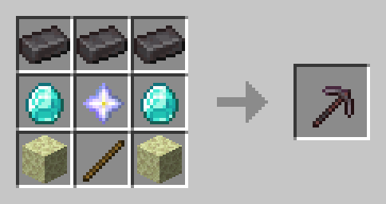

# Кастомные крафты

**Супер кирка**

* Копает область 3x3x3 блока.
* 5678 единиц прочности
* 6 единиц урона

Крафт

* 3 незеритовых слитка
* 2 алмаза
* 2 эндерняка
* 1 палка
* 1 звезда нижнего мира

<figure><figcaption></figcaption></figure>

***

**Зачарованное золотое яблоко**

Крафт

* 4 золотых блока
* &#x20;2 золотых яблока
* 1 яблоко
* 1 зелье огнестойкости
* 1 зелье регенерации

<figure><figcaption>
<strong>1 - зелье огнестойкости, 2 - зелье регенерации</strong>
</figcaption></figure>

***

**Палка откладки**

* Для творчества не помешает

Крафт

* 2 палки
* 1 незеритовый слиток

<figure><figcaption></figcaption></figure>

***

**Тотем бессмертия**

Крафт

* 4 алмаза
* 1 незеритовый нагрудник
* 2 золотых яблока
* 1 трезубец
* 1 элитры

<figure><figcaption></figcaption></figure>

***

Увы, пока всё!

Скоро будет добавлено больше кастомных вещей.
